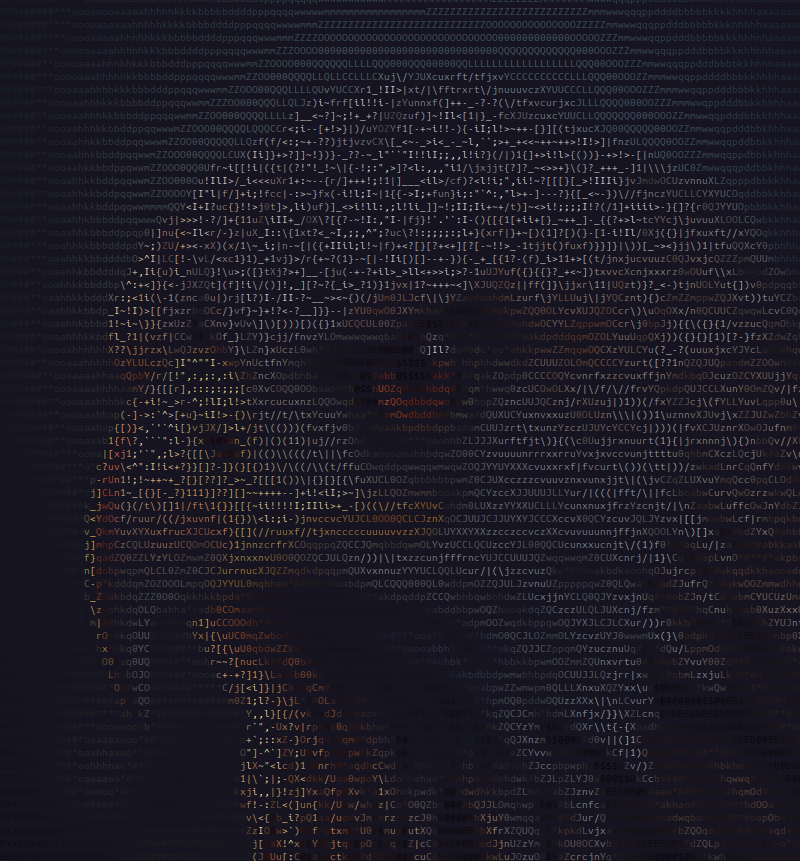
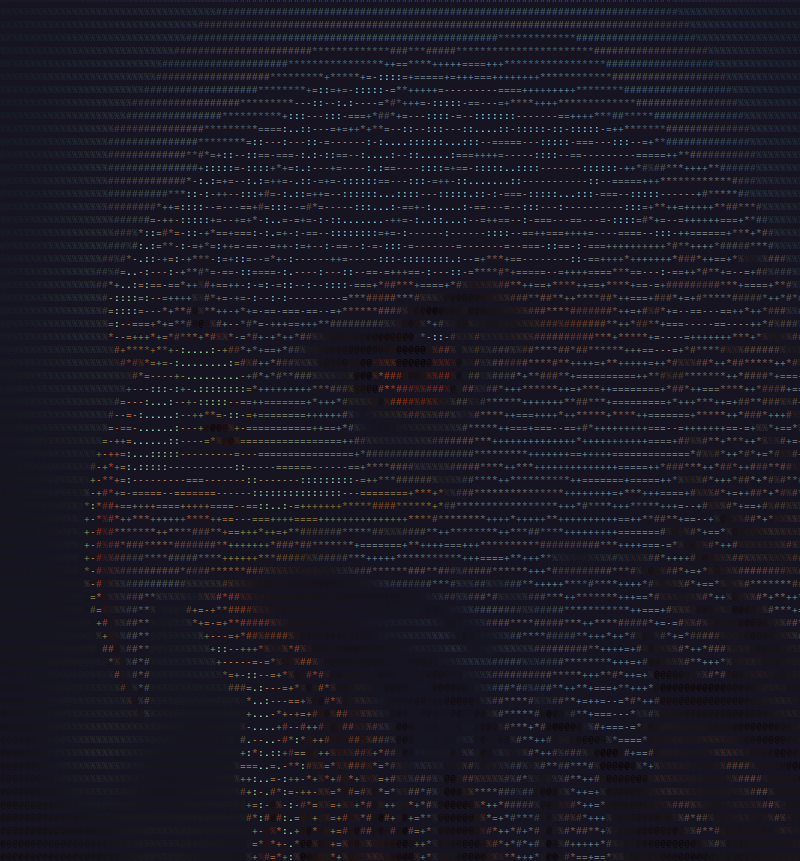

# Img2Ascii_Pro
تحويل الصور إلى فن ASCII بسهولة باستخدام بايثون  

---

## نظرة عامة  
مكتبة **Img2Ascii_Pro** تتيح لك تحويل أي صورة إلى شكل فني ASCII سواء أبيض وأسود أو ملوّن.  
تُستخدم لتحويل الصور إلى نصوص جميلة يمكن عرضها في الطرفية أو حفظها في ملف txt أو html

---

## التثبيت

قم بتثبيت المكتبة باستخدام pip:

```bash
pip install img2ascii-pro
```
---
بعد التثبيت، يمكنك تشغيل المكتبة مباشرة من الطرفية بالأمر التالي:
img2ascii_pro myphoto.jpg

---
يمكنك تحديد عرض الصورة (العرض يؤثر على التفاصيل)
img2ascii_pro myphoto.jpg --width 100

---
الصورة الأصلية:


---
المكتبة تحتوي على عدة أنماط جاهزة:

realistic:شكل واقعي بدرجات كثيرة

img2ascii_pro myphoto.jpg --preset realistic


---
minimal: شكل بسيط جدًا
img2ascii_pro myphoto.jpg --preset minimal



---
block: الصورة أكثر وضوحًا وتشبه الصورة الأصلية جدًا
img2ascii myphoto.jpg --preset block


---
لعكس النصوص (مفيد للصور الداكنة):
img2ascii_pro myphoto.jpg --invert

---
يمكنك حفظ المخرجات في ملف نصي بدل عرضها في الترمنال:
img2ascii_pro myphoto.jpg --outfile img.txt

---
يمكنك حفظ المخرجات في ملف html بدل عرضها في الترمنال:
img2ascii_pro myphoto.jpg --html img.html

---
يمكن استخدامه داخل كود بايثون مباشرة أيضًا:
from PIL import Image
from img2ascii_pro import *

img = Image.open("photo.jpg")
ascii_lines, _, _, _ = image_to_ascii(img, width=100, chars=PRESETS["block"])

for line in ascii_lines:
    print(line)


